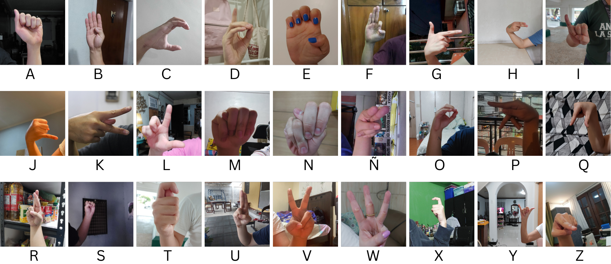

# In-The-Wild Filipino Sign Language Alphabet Dataset

Explore the Filipino Sign Language (FSL) image dataset. Capturing the richness of FSL through visual representations.

## Table of Contents
- [Description](#description)
- [Dataset Overview](#dataset-overview)
- [Abstract](#abstract)
- [Sample Visuals](#sample-visuals)
- [Dataset Access Request and Usage Guidelines](#dataset-access-request-and-usage-guidelines)
- [Contact Us](#contact-us)

## Project Website
Visit our [project website](https://campol-russel.github.io/In-the-wild-FSL/).

## Description
The objective of this study is to create and release a Filipino Sign Language (FSL) image dataset for public access. This comprehensive dataset includes 8100 images distributed across 27 classes representing the Filipino Alphabet, contributed by 100 participants who captured 81 images each using their devices. Users interested in utilizing this dataset are kindly requested to follow the provided guidelines and submit a form containing essential information, such as the representative's name, project details, how they intend to use the dataset, and their contact details. The dataset supervisor/s will review these requests to determine eligibility for dataset access. This process ensures that the dataset is used only for its intended purpose and serves as a record of authorized users, making any unauthorized usage easily detectable.

## Dataset Overview
- **Total Images:** 8100
- **Number of Classes:** 27
- **Collection Method:** Images captured by 100 participants using phone cameras

## Abstract
In the Philippines, there is a scarcity of research on the deaf and mute culture, making institutions exclusive and limiting opportunities for the growth of the deaf and mute. This study aims to contribute to the development of real-time and accessible sign language detection and recognition systems. The dataset introduces a Filipino Sign Language dataset, addressing existing image dataset gaps. Data collection involved 100 adult participants capturing alphabet signs in varying environments. The open-source dataset contains 8,100 images, benchmarked in different models for broader use in the Filipino deaf community.

## Sample Visuals

*Figure 1: Sample Visuals of the FSL Alphabet image dataset*

## Dataset Access Request and Usage Guidelines
Thank you for your interest in accessing the Filipino Sign Language (FSL) image dataset. To maintain the integrity and intended use of the dataset, we have established the following guidelines for access requests.

### Access Request Process:
1. **Submission of Request:**
   - State your interest in accessing the dataset.
   - Submit a request form with representative's name, project details, intended use, and contact details.
2. **Dataset Access Review:**
   - Supervisors will review requests to ensure eligibility and prevent misuse.

## Contact Us
If you have any questions, feel free to contact us at:

**Email:**
- arren.antioquia@dlsu.edu.ph
- campol_russel@dlsu.edu.ph
- carl_delacruz@dlsu.edu.ph
- jericho_dizon@dlsu.edu.ph

Built with [Pico](https://picocss.com) • [Source Code](https://github.com/picocss/examples/blob/master/v1-classless/index.html)
